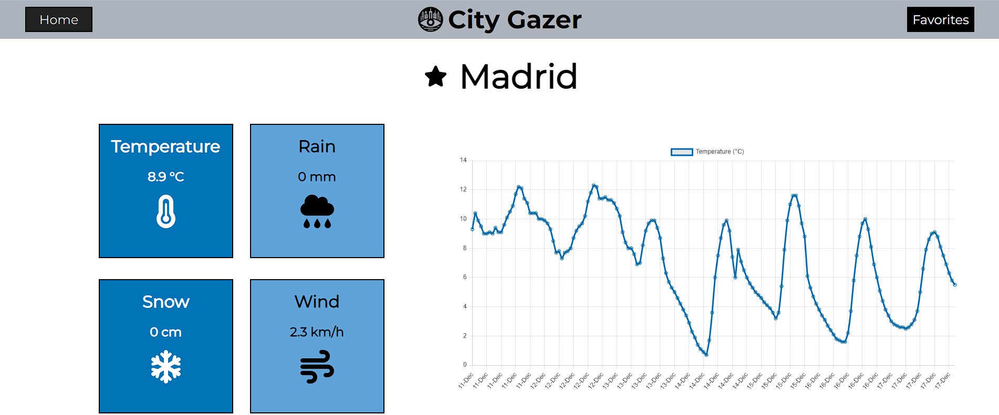
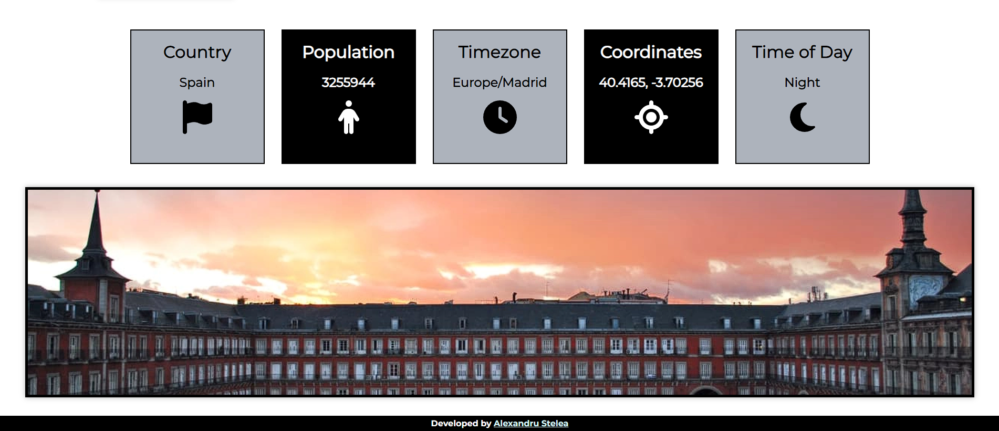

# City Gazer

## Overview

City Gazer is a web application built with Next.js and React, allowing users to explore various cities and obtain detailed information including location, weather updates, photos, and more. Users can also save their favorite cities for later reference.

## Features

- **City Search**: Search and retrieve information about cities.
- **Weather Updates**: Real-time weather information for searched cities.
- **Favorite Cities**: Ability to mark and save preferred cities for easy access.

## Technical Stack

- **Frontend**: Next.js, React, JSX, CSS

## Screenshots

1. **Landing Page**:
   

2. **Home Page**:
   

3. **Gaze City Page**:
   
   

## Setup Instructions

To run City Gazer locally, follow these steps:

1. **Clone the Repository**: Clone the City Gazer repository to your local machine.
2. **Install Dependencies**:
   - Navigate to the project directory.
   - Run `npm install` to install required dependencies.
3. **Start the Development Server**:
   - Run `npm run dev` to start the Next.js development server.
4. **Explore City Gazer**:
   - Access City Gazer by visiting `http://localhost:3000` in your browser.
